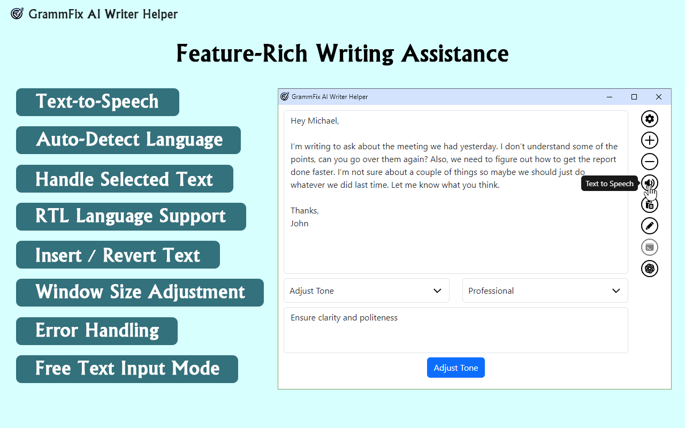
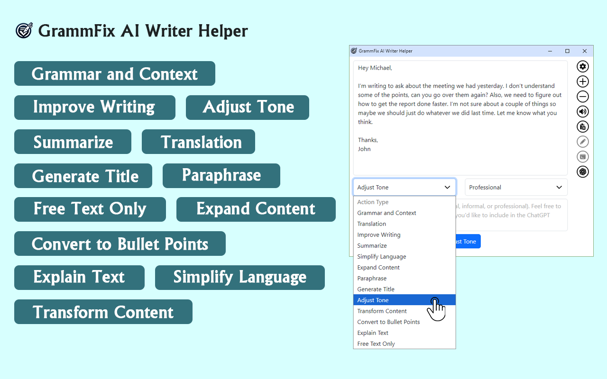
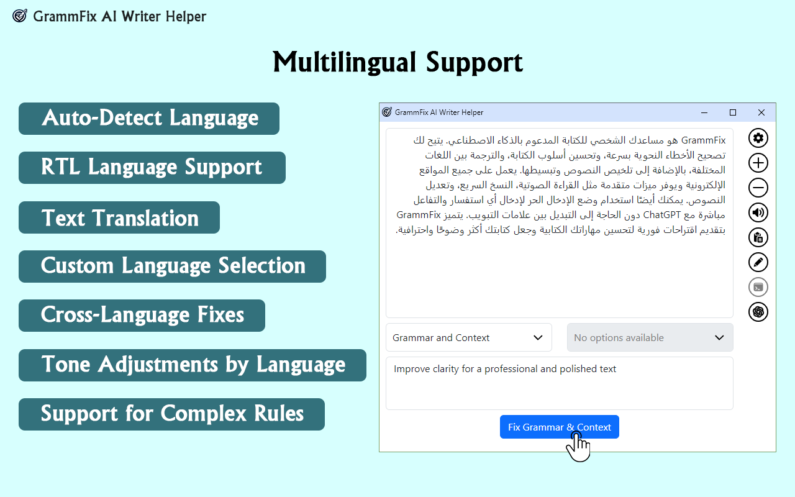
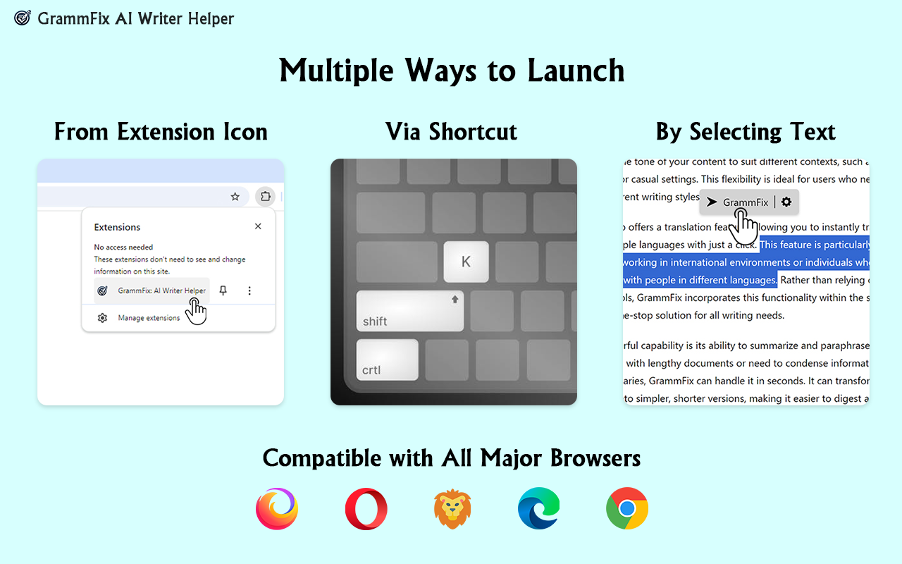

# GrammFix: Your All-in-One AI Writing Assistant

GrammFix is a powerful, user-friendly browser extension that goes beyond just correcting grammar. With features like translation, tone adjustments, content expansion, text-to-speech, and more, GrammFix helps you enhance your writing across any website.

## Features

GrammFix provides a comprehensive set of tools to help you write clear, engaging, and professional content. Here’s what GrammFix can do:

- **Grammar and Context Fixing**: Instantly corrects grammatical errors and clarifies sentence meaning.
- **Translation**: Translate text to multiple languages seamlessly.
- **Writing Enhancements**: Improve overall text quality, from tone adjustments to rephrasing.
- **Content Expansion**: Add depth to your content with intelligent suggestions.
- **Simplify Language**: Rewrite complex sentences in simpler terms.
- **Text to Speech**: Listen to your text for improved clarity.
- **Multi-Language Support**: Supports right-to-left languages like Arabic and Hebrew and auto-detects language.

## Action Options

GrammFix provides a variety of writing actions to make your content even better. Here are some of the available options:

## Multilingual Support

GrammFix supports a wide range of languages, including right-to-left languages like Hebrew and Arabic. With automatic language detection, it’s easy to write in any language and receive tailored suggestions.

## Launch Options

GrammFix is designed to be easily accessible, so you can launch it in multiple ways:
- Launch from the extension icon
- Use keyboard shortcuts
- Select text directly on the page to open GrammFix options

## Installation

GrammFix is available on major browsers:

- [Firefox Add-on](https://addons.mozilla.org/he/firefox/addon/grammfix)
- [Chrome Web Store](https://chromewebstore.google.com/detail/grammfix-ai-writer-helper/ehefhikaopahjgppnedlfafikbgmehih)
- [Microsoft Edge Add-on](https://microsoftedge.microsoft.com/addons/detail/grammfix-ai-writer-helpe/mknbnkmebpanmapkkcljcihonopgogfd)

## Usage

1. Install the GrammFix extension from your preferred browser.
2. Launch GrammFix using one of the multiple options (extension icon, shortcut, or selecting text).
3. Choose your desired action, such as grammar correction, tone adjustment, translation, or text-to-speech.
4. Apply GrammFix suggestions directly to enhance your writing instantly.

## FAQ

### How does GrammFix work?
GrammFix leverages advanced AI to analyze and enhance your writing. It provides real-time feedback and suggestions, making your content clearer and more professional.

### Is GrammFix free to use?
Yes, GrammFix is free to use with unlimited access to basic features. An optional upgrade provides access to the latest AI model and additional features.

### What happens to my data?
Your data is processed securely and is never stored or shared. GrammFix uses encrypted connections to keep your writing private.

## License

GrammFix is licensed under the MIT License.
